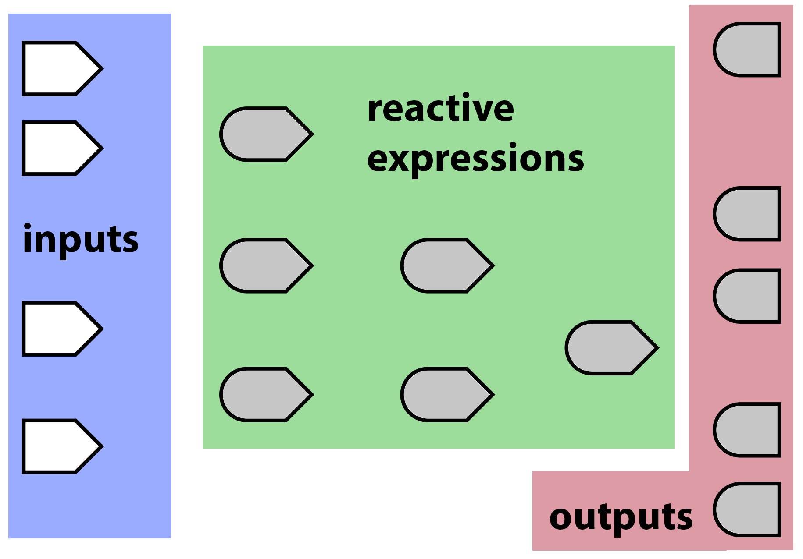
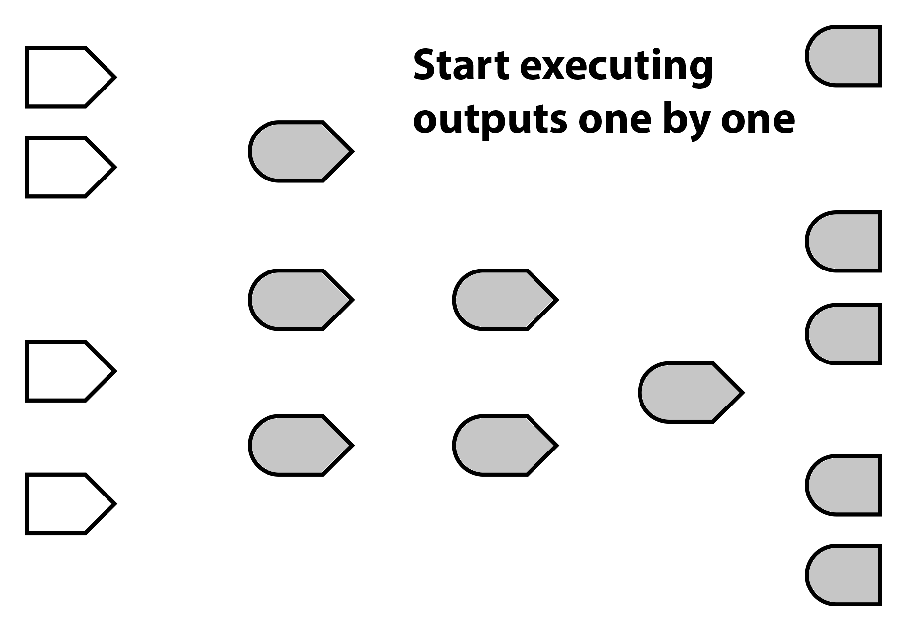
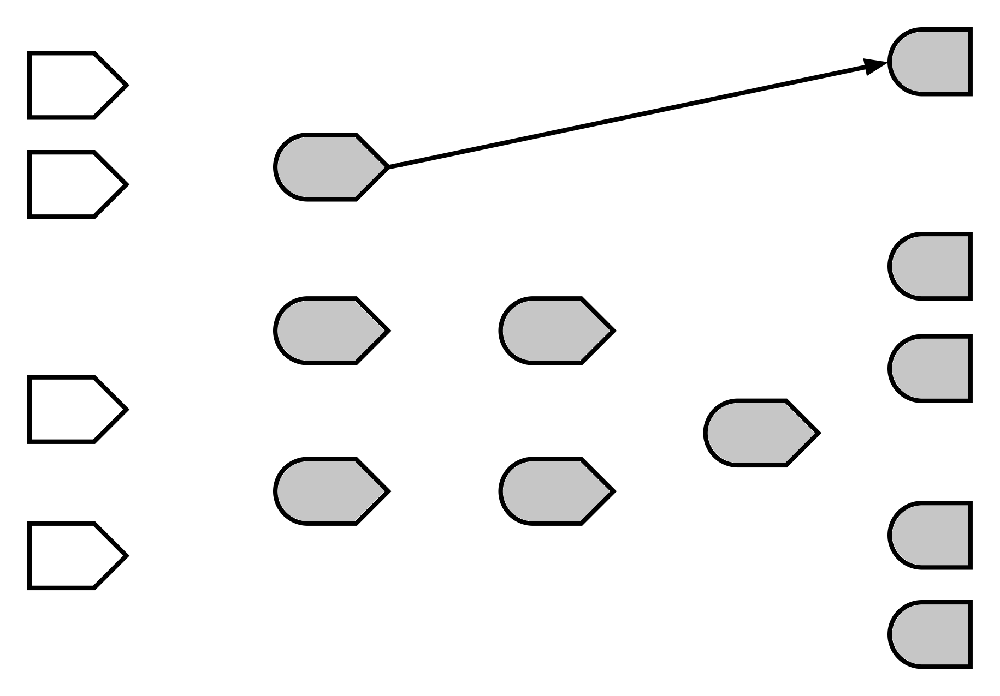
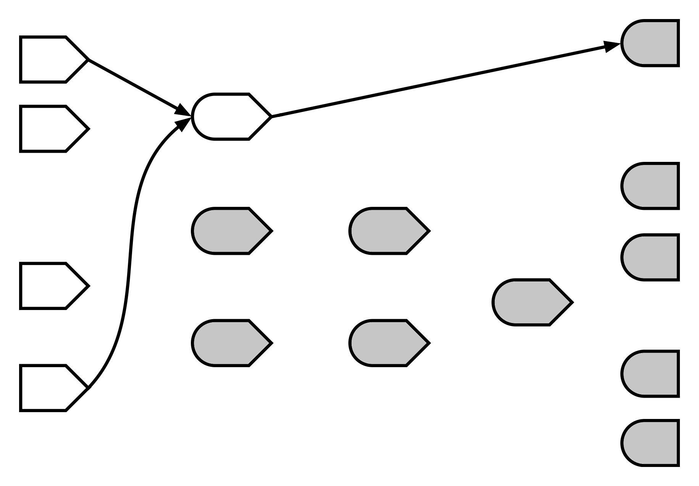
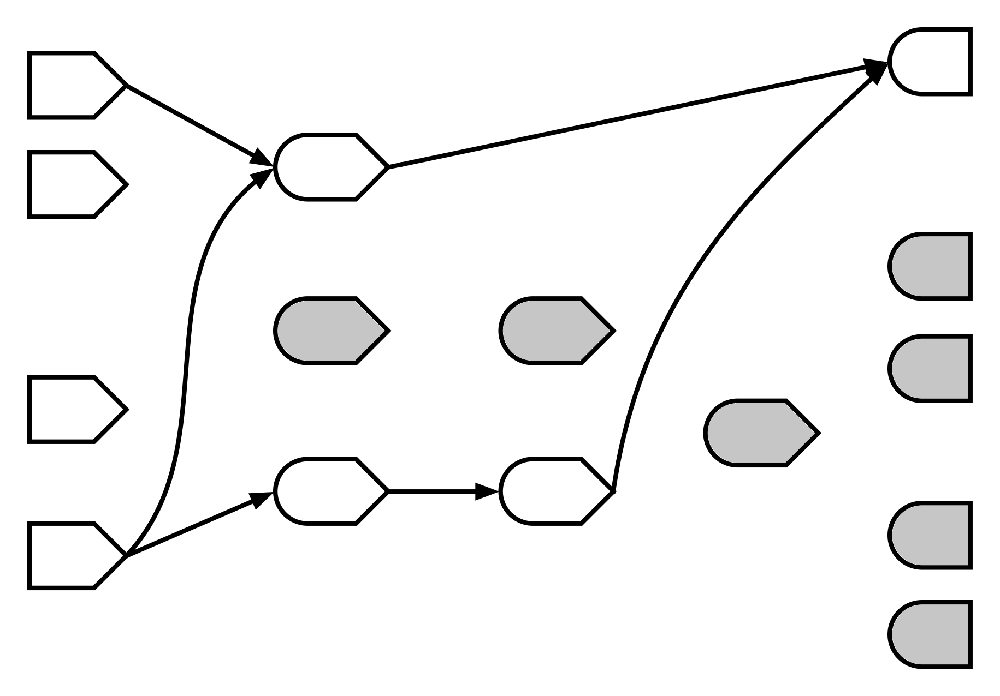
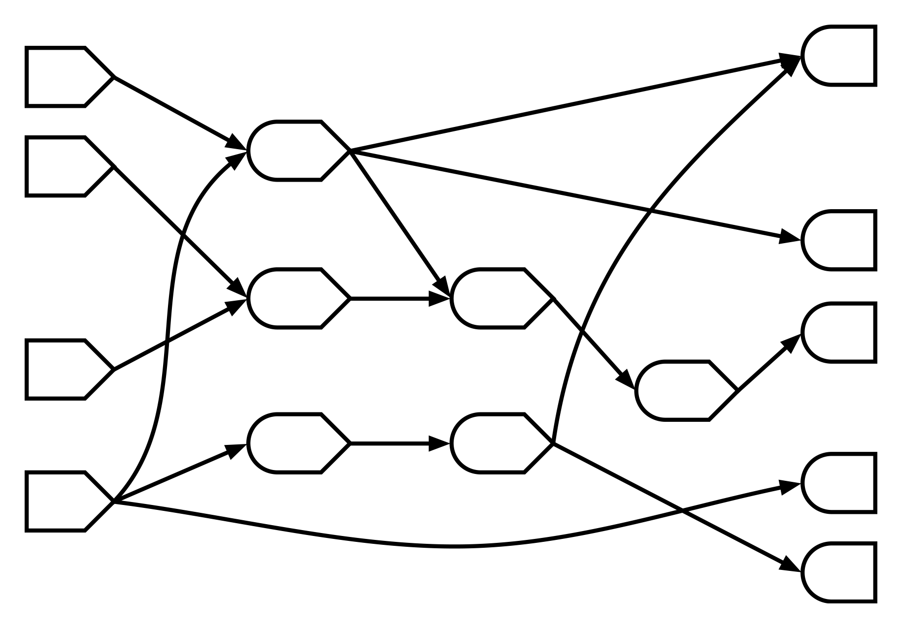
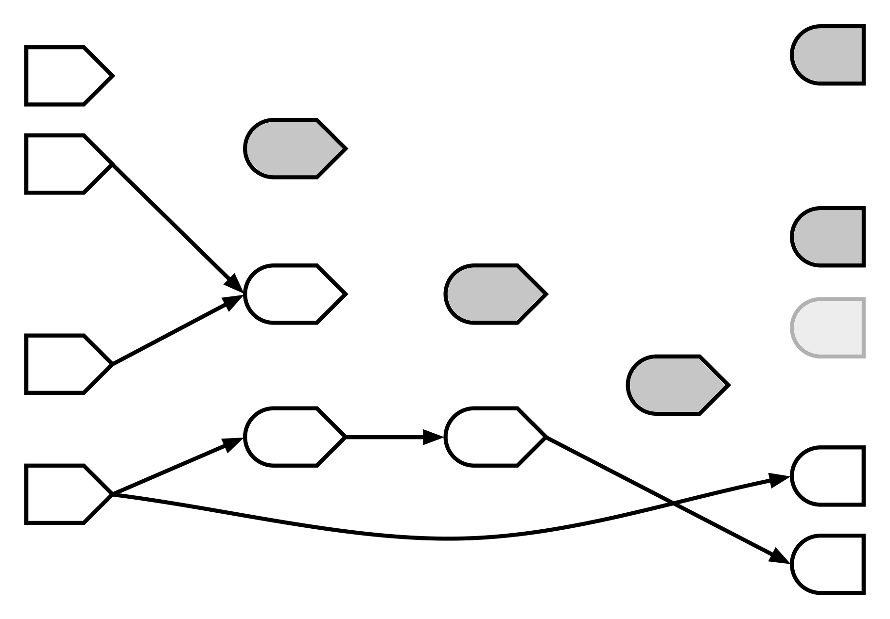

```{r setup, include=FALSE}
options(htmltools.dir.version = TRUE)
library(shiny)
library(ggplot2)
library(dplyr)
```

class: inverse
# Agenda

1. Recap Shiny Session I
  + <i><font size="2">1. User Input - input() </font></i>
  + <i><font size="2">2. Reactive Function - reactive() </font></i>
  + <i><font size="2">3. Render Ouput - output () </font></i>

--
  
2. Under the hood of Reactivity

--

3. Extend with obverve Events and Isolate 

--

4. Brushing & Linking

--

5. htmlwidgets library
  + <i><font size="2">DT</font></i>
  + <i><font size="2">parcoord</font></i>
  + <i><font size="2">leaflet</font></i>
  
--

6. crosstalk <i><font size="2">brushing & linking for htmlwidgets</font></i>

--

7. Next Actions

???
---

## Learning Materials

- These slides were created in rmarkdown using remark.js and the [xaringan package](#https://github.com/yihui/xaringan)


- You can access the slides on the shiny server at

  - [insert link](www.google.com)


- All code for examples nd creating these the slides are on Codehub:

  - [insert link](www.google.com)

---

class: inverse
# 1. Recap Shiny Session I

- Shiny
  - Web application framework in R
  - Doesn't require HTML, Javascript or CSS 
  - Reactive programming model

- Motivation
  - Shiny allows the creation of a data product/artifact for people to engaged with your analysis. 

- Intro
  - Input Widgets, Outputs, Reactive Programming

  - [Recap on 3 examples](www.google.com)
---

class: inverse
# 2. Under the hood with Reactivity

- Reacitve Expressions

- Reactive Expression Theory
---

## Reactive Expressions

- *Expression:* Code that produces a value

- *Reactive:* Detects changes in anything reactive that it reads

```{r reactive, eval = F}
server = funtion(input, output, session) {
  # When iput$min_size or input$max_size change, large_diamonds
  # will be notified about it
  large_diamonds <- reactive({
    diamonds %>% filter(carat >= input$min_size) %>%
      filter(carat < input$max_size)
  })
  
  mean_price <- reactive({ mean(large_diamonds()$price) })
  
  output$message <- renderText({
    paste0( nrow (large_diamonds ()), 
            "diamonds in that range, ",
            "with an average price of $ ", mean_price())
  })
}
```

<font size = 1>Source: https://www.rstudio.com/resources/webinars/shiny-developer-conference/</font>

???
Takeaway: 
- when calling a reacitve expression have to use () or function notation.
- Reacitve expressions can read other reacitve expressions
---

## Reavtive Theory


???
- Shapes give a hint about the relationship between each other. 
- Inputs: Left side shapes are inputs  - can be read - pointy values flow out of inputs. 
- Outputs: Consume values - round on one side 
- Flat edgets of Input/Ouput are what the user sees
- Reactive Expressions - can cosume values (round side) and can be read (pointy side) 
---

## 

???
- Colour is the state. - Grey is invalid. 
- This represents a bit more complicated shiny app. Nodes on a graph with no connections between them.  
- This is the starting state, only the inputs are valid. Shiny builds dependencies between these. 
---
## 

???
- Starts with the outputs and finds out what reacitve expressions it relies on. - It wants to get into a valid state.
---
## 

???
- In turn the reactive expressions is relying on two inputs or  consumes two inputs 
- Makes connection and enters valid state (white)
---
## 

???
- The output then consumes the reactive and becomes valid
- The output could be more complext and rely on more than one reactive. 
---

## 

???
- Builts out dependency graph and all are valid
---

## 

???
- The user changes the top input. 
- All the links in reactive are broken and reactive becomes invalid
- Simarly links between reactives and outputs are broken
- Chains is broken
- Shiny rebuilds the dependency graph from the output - reactive - input, to get back to valid state. 
---

class: inverse
# 3. Observe  and Isolate

- Observer and isolate introduce more control over 
  
  - how/when the dependency graph is recalculated. 
---

## observe

observe come in two types

- Implicit

```{r observeImp, echo=T, eval = F}
server = function(input, output, session){
   output$myvalue <- observe({
     input$y
    cat("The value of input x is now ", input$x)
  })
}
```

- Explicit

```{r observeExp, echo = T, eval = F}
server = function(input, output, session){
   output$myvalue <- observeEvent(input$upload_button, {
     cat("The value of input x is now ", input$x)
  })
}
```

???
- Implicit: depend on all reactive values/expression encourted in the observer function execution
- Explicit: Just depend on a specific reactive value/expression ignore all others 
- Explicit: is the the more common use case, 90% of all button operations
- Example: 1.example-actionButton.R

---

## Observers vs. Reactives

- reactive() can be called and return values 
- observe() and observerEvent() cannot be called or return a value

--

- reactive expressions are cached - if nothing changes, just give back its current state
- obverve have no cache

--

- reactive extressing are lazy, don't execute until needed
- observe are eager, when a dependency changes will execute
---

## Confused... 

- Me too!!! 

- General rule of thumb, 90% of the time you will use an observeEvent with an action button. 

  - reactives do not have side effects, observers do
--

  - **side effect?** ... e.g. writing to disk

```{r, eval = F,echo =T}
server = function(input, output, session) {
      observeEvent(input$write, {
        write.csv(df,row.names=F, file="data/df.csv")
     })
}
```
---

## isolate

- endpoint to access a reactive value or expression, but not to take a dependency on it. 


???
- Jump straight into example
- Example: 2.example-isolate.R
- Note: when you start using isolate, your project is becoming complicated.

---

class: inverse
# 4. Linking & Brushing 

- Interactivity has been limited to shiny::inputWidgets
  - selectInput()
  - numericInput()
  - slider Input()
  - ...
--

- plots are based on curent R plotting packages
  - essentially static
--

- Expand to make static plots interactive
  - click, hover brush
  - **links** plots

- Co-ordinating multiple views
---

## click, hover, brush

- in the **ui** create a reactive **id** in the plotOutput() 

```{r,eval=F,echo=T}
#click
ui <- plotOutput("plot", 
                 click = clickOpts(id="plot_click"))

#hover
ui <- plotOutput("plot",  
                 hover = hoverOpts(id = "plot_hover", 
                                   delayType = "throttle"))

#brush 
 ui <- plotOutput("plot",  
                  brush = brushOpts(id = "plot_brush"))
```
???
Example: 3.example-click-hover-brush.Rmd
---

# 5. htmlwidgets

- **htmlwidgets** is an R package that provides a comprehensive framework to
create interactive javascript based widgets, for use from R. 

- widgets can be used at the R console, embedded in an R Markdown report, or inside a Shiny web application. 

- take javascript library and create R library

- not going to discuss that process
--

- Examples
  - DT
  - Leaflet
  - threejs
--

- Other notable mentions
  - plotly
  - parcoords (my favourite!)
  - dygraphs (timeseries data)
  - [Gallery of htmlwidgets ports](http://gallery.htmlwidgets.org/)

???
- Focus on mapping and network examples here as some people are working on stuff related to that
- NOTE: all these examples are running in presentation. Doesn't require shiny. 
---

## DT

- The R package [DT](http://rstudio.github.io/DT/) provides an R interface to the JavaScript library DataTables. 
- R data objects (matrices or data frames) can be displayed as tables on HTML pages
- DataTables provides filtering, pagination, sorting


```{r dtExample, echo = T, eval =F}
m <- cbind(
  matrix(rnorm(40, 1e+05, 1e+06),20),
  runif(20), 
  rnorm(20,100))

m[,1:2] <- round(m[,1:2])
m[,3:4] <- round(m[,3:4],7)
colnames(m) <- head(LETTERS, ncol(m))

library(DT)
datatable(m) %>% 
  formatCurrency(c("A")) %>% 
  formatCurrency("B","€") %>% 
  formatPercentage("C",2) %>% 
  formatRound("D",2)
```
---

```{r dtExample,echo=F, eval =T, warning =F, message = F, error=F}
```
---

## Leaflet

- [Leaflet](http://rstudio.github.io/leaflet/) is one of the most popular open-source JavaScript libraries for interactive maps. 
- makes it easy to integrate and control Leaflet maps in R.
- lets plot the *Optum* Dublin Office and Dublin Bikes

```{r leafletExample, echo=T, eval=F}
library(ggmap)
library(leaflet)

somePlace <-ggmap::geocode("Optum,Dublin, Ireland")      
dublinbikes <- read.csv(file = "examples/dublinbikes_gps.csv",
                        skip=3,header=T)

leaflet() %>% 
  addTiles () %>% 
  setView(somePlace$lon, somePlace$lat, zoom=15) %>% 
  addMarkers(somePlace$lon, somePlace$lat) %>%
  addCircleMarkers(dublinbikes$Longitude..WSG84.,
                   dublinbikes$Latitude..WSG84.)
```
---

```{r leafletExample,echo=F, eval =T, warning =F, message = F, error=F}
```
---

## threejs

- Three.js is a cross-browser JavaScript library/API used to create and display animated 3D computer graphics in a web browser. Three.js uses WebGL. 

- There is a development version of [threejs](https://github.com/bwlewis/rthreejs)


```{r threejsExample1, echo=T, eval = F}
library(threejs)
data(LeMis)
graphjs(LeMis, vertex.shape = "sphere",  
        left = "500px",
        font.main = "16px Arial",
        layout = layout_with_fr(LeMis,dim=3, niter=30), 
        main=c("Force Layout"))
```

- [Les Miserable Character Interactions](www.google.com)

```{r, echo =T, eval = F, }
data(ego) #
graphjs(ego, bg="black")
```

- [Stanford SNAP network analysis library - facebook subset , 4k vertices, 80k edges](www.google.com)
---

## htmlwidgets with shiny

- htmlwidget libraries don't need shiny

- this is a shiny talk! so lets use with shiny


???
Example:5.  
---

## Crosstalk

- introduced shiny for linking charts and htmlwidgets libraries

- requires a shiny server

- new add-on to the htmlwidgets package [crosstalk](https://rstudio.github.io/crosstalk/index.html)
    
    - allows htmlwidgets interact/link with each other without shiny
    -  designed to work with widgets that take data frames (or sufficiently data-frame-like objects) as input.

  - main concept is **SharedData$new()**
  
  - **crosstalk is very new, libraries require newer version of R**
    
```{r crosstalkExample, eval = F, echo=F}
library(d3scatter)
library(crosstalk)

shared_mtcars <- SharedData$new(mtcars)

bscols(widths = c(3,NA,NA),
  list(
    filter_checkbox("cyl", "Cylinders", shared_mtcars, ~cyl, inline = TRUE),
    filter_slider("hp", "Horsepower", shared_mtcars, ~hp, width = "100%"),
    filter_select("auto", "Automatic", shared_mtcars, ~ifelse(am == 0, "Yes", "No"))
  ),
  d3scatter(shared_mtcars, ~wt, ~mpg, ~factor(cyl), width="100%", height=250),
  d3scatter(shared_mtcars, ~hp, ~qsec, ~factor(cyl), width="100%", height=250)
)


```


???
Visualising the same data points.


---

class: inverse
# 7. Next Actions

- What didn't cover
 - `validate` and `req` 
 - Shiny modules
 
--

- Next Session
  - practical tips
  - debugging your apps
  - deployment with Shiny Server and packrat
  - suggestions (please contact myself or Robert)
  
  
???
`req` is a lightweight way to achieve cascading stopping of executions, that aren't error conditions. Red signals
 As Shiny applications grow larger and more complicated, app authors frequently ask us for techniques, patterns, and recommendations for managing the growing complexity of Shiny application code.